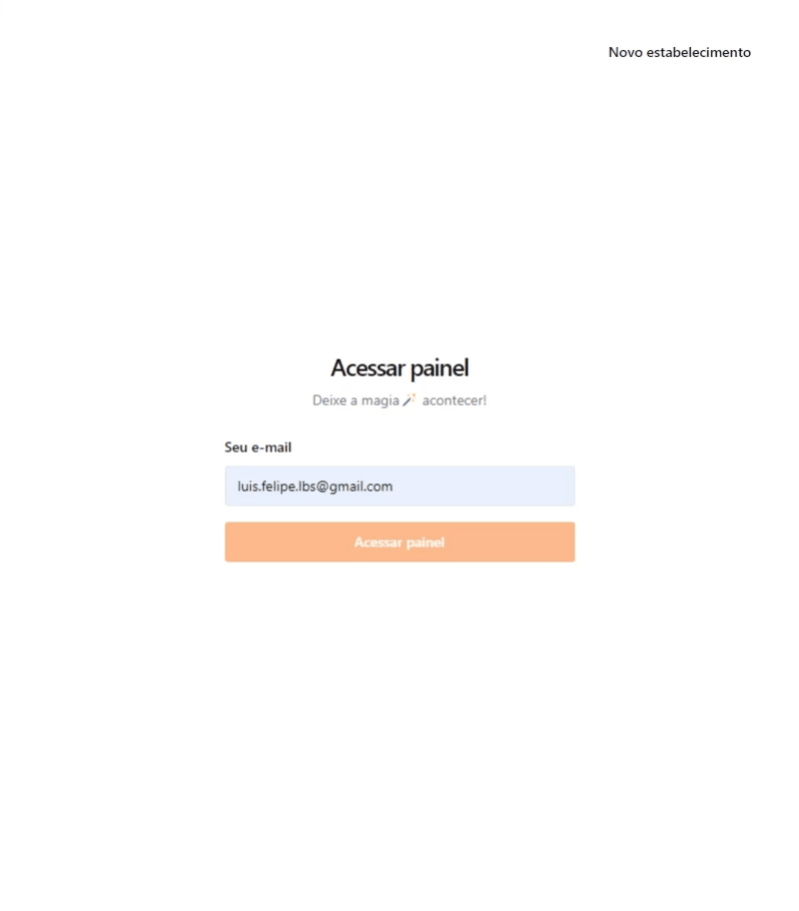
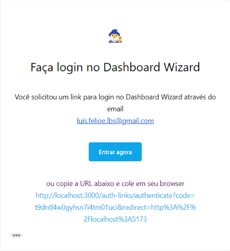

# Dashboard Wizard 🧙‍♂️


> ERP focado no feedback visual dos dados.
<br><br>

### Magic Link

Aplicado nesse projeto o pattern Magic Link de autenticação onde apenas com o e-mail do parceiro já é possível autentica-ló na aplicação de maneira rápida e fácil.
> Informando o e-mail cadastrado no formulário de autenticação do painel de parceiros.
> 
> 
><br><br>
>
> E-mail enviado pelo Dashboard Wizard 🧙‍♂️.
>
> 

## 🚀 Instalando o Dashboard Wizard 🧙‍♂️.

Para clonar e executar o projeto, siga estas etapas:

clonando o projeto
```
git clone
```
<br>

preenchendo as variáveis de ambiente
```
VITE_API_URL="http://localhost:3333" - url da api
VITE_ENABLE_API_DELAY=0 - delay em ms desejado para o retorno das requisições
```
<br>

executando o projeto
```
npm run dev
```
<br>
## DashboardWizard-api

[Veja](https://github.com/luis-lbs/DashboardWizard-api) a API construida usando [Bun](https://bun.sh/) que dá vida ao Dashboard Wizard 🧙‍♂️.

## 🤝 Colaboradores

<table>
  <tr>
    <td align="center">
      <a href="https://github.com/luis-lbs" title="GitHub de Luis Felipe">
        <br>
        <sub>
          <b>Luis Felipe</b>
        </sub>
      </a>
    </td>
  </tr>
</table>

## 📝 Licença

Esse projeto está sob licença. Veja o arquivo [LICENÇA](LICENSE.md) para mais detalhes.
